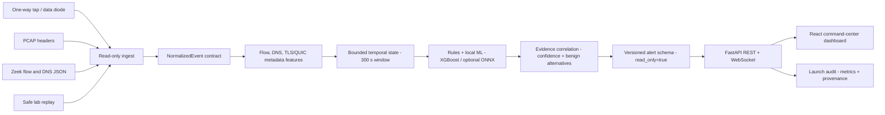

# NetSentinel | SIH 2026 Passive Network Threat Detection

> **An explainable, metadata-only, streaming cyber-threat intelligence and early-warning platform for unidirectional network monitoring enclaves.**  
> Built for Smart India Hackathon 2026 — Problem Statement 26145.

[](https://www.python.org/)
[](https://fastapi.tiangolo.com/)
[](https://onnxruntime.ai/)
[](LICENSE)

**Submission:** Smart India Hackathon 2026 | PS 26145<br>
**Team:** Soumdoitya Das and Team NetSentinels<br>
**Operating principle:** See everything. Touch nothing. Trust the chain.

---

## 🎯 The NetSentinel Philosophy

NetSentinel is designed strictly for **unidirectional, read-only monitoring** (data diodes or tap networks).  
It does **not** block traffic, does **not** fetch live malware, and does **not** decrypt payloads.  
Instead, it correlates **metadata-only** anomalies (using PCAP headers or Zeek JSON logs) to provide explainable defensive intelligence.

## Judge and operator documents

- [`docs/technical.md`](docs/technical.md) - end-to-end technical design, data contracts, and operations.
- [`docs/PPT.md`](docs/PPT.md) - presentation-ready slide narrative and demo sequence.
- [`docs/previous-vs-current.md`](docs/previous-vs-current.md) - honest comparison with the earlier GitHub baseline.

- [`docs/TECHNICAL_DEFENSE_BLUEPRINT.md`](docs/TECHNICAL_DEFENSE_BLUEPRINT.md) — architecture, features, governance, and throughput.
- [`docs/RED_BLUE_TESTING.md`](docs/RED_BLUE_TESTING.md) — safe adversary emulation and blue-team validation runbook.
- [`docs/COMPARISON.md`](docs/COMPARISON.md) — capability comparison with Defender, Zeek, and Suricata-style deployments.
- [`docs/safe_lab.md`](docs/safe_lab.md) — generated fixture formats and download API.

For the current attack-family boundary and ATT&CK alignment, see
[`docs/THREAT_COVERAGE_MATRIX.md`](docs/THREAT_COVERAGE_MATRIX.md).

### Additive analyst console

The optional NetSentinel Plus sidecar is self-contained and documented here:

- [`addons/netsentinel_plus/README.md`](addons/netsentinel_plus/README.md) — features, API surface, and launcher usage.
- [`addons/netsentinel_plus/docs/STARTUP.md`](addons/netsentinel_plus/docs/STARTUP.md) — PowerShell setup and one-command startup.
- [`addons/netsentinel_plus/docs/TECHNICAL.md`](addons/netsentinel_plus/docs/TECHNICAL.md) — architecture, data contract, and safety boundary.
- [`addons/netsentinel_plus/docs/SIH_PRESENTATION.md`](addons/netsentinel_plus/docs/SIH_PRESENTATION.md) — judge-facing slide-by-slide presentation.
- [`addons/netsentinel_plus/docs/COMPARISON.md`](addons/netsentinel_plus/docs/COMPARISON.md) — baseline versus additive capabilities.

### Key Differentiators

| Claim | Reality |
|---|---|
| No False Promises | Threat intelligence is presented as a correlated risk score with visible limitations — not "100% accuracy". |
| Legitimate-Service C2 | We do not blacklist Telegram or OneDrive. NetSentinel detects *anomalous behavioral usage* based on beaconing timing, byte-transfer asymmetry, and DNS context. |
| Bounded-Latency Streaming | Analysis uses TTL-evicted time-windows (StateManager, TTL=300s) to prevent unbounded memory growth while guaranteeing low-latency alerting. |
| Transparent Evidence | Every alert follows a versioned Pydantic schema that explicitly declares `read_only=True` and `payload_decrypted=False`, and lists the exact evidence used. |

---

## System architecture (Eraser-ready)

The diagram uses explicit system boxes and one-way arrows. It can be pasted
into Eraser or rendered directly by GitHub as Mermaid.



### Runtime flow

1. A data diode, PCAP file, Zeek record, or safe replay provides metadata.
2. Adapters validate and normalize each event without sending traffic back.
3. Temporal state aggregates bounded windows for fan-out, timing, entropy, and
   byte asymmetry signals.
4. Rules, the verified local XGBoost artifact, and optional ONNX wrappers emit
   evidence; correlation reduces single-field guesses.
5. FastAPI publishes versioned alerts to the dashboard and writes launch
   metrics that can be audited separately from live telemetry.

## Component map (text fallback)

```text
┌─────────────────────────────────────────────────────────────────┐
│  Ingest Layer                                                   │
│  PCAP (pcap_adapter.py)  ──┐                                    │
│  Zeek JSON (zeek_adapter)  ├──▶  NormalizedEvent (Pydantic)     │
│  Simulator (traffic_gen)  ─┘                                    │
└───────────────────────────────────────┬─────────────────────────┘
                                        │
                                        ▼
┌─────────────────────────────────────────────────────────────────┐
│  Streaming State Manager  (StateManager, TTL-evicted per host)  │
└───────────────────────────────────────┬─────────────────────────┘
                                        │  host_state snapshot
                  ┌─────────────────────┼─────────────────────────┐
                  ▼                     ▼                         ▼
      Real XGBoost / optional ONNX  Rule Detectors       Correlation
         ─────────────────       ──────────────           ──────────
         DDoSDetector            ReconRuleDetector        Engine
         C2BeaconDetector        ExfilBaseline
         DGADetector             LegitServiceC2
         EncryptedTrafficDet.
                  └─────────────────────┬─────────────────────────┘
                                        │  Alert (AlertSchema v1.0)
                                        ▼
                         AlertManager / WebSocket Hub
                                        │
                  ┌─────────────────────┴─────────────────────────┐
                  ▼                                               ▼
           REST API  (/api/*)                          React Dashboard
           FastAPI + Pydantic                          WebSocket (/ws)
```

---

## 🔍 Detection Capabilities (SIH 26145 Compliance)

| Threat | Detector | Algorithm | MITRE |
|---|---|---|---|
| **Volumetric DDoS** | `DDoSDetector` | XGBoost on 83 flow features | T1498 |
| **Botnet C2 Beaconing** | `C2BeaconDetector` | BiLSTM temporal-sequence model | T1071 |
| **DGA / DNS Tunneling** | `DGADetector` | CNN-BiLSTM + Shannon entropy guard | T1568 / T1048 |
| **Malware in Encrypted TLS** | `EncryptedTrafficDetector` | Transformer on TLS metadata — **no decryption** | T1573 |
| **Reconnaissance / Port Scan** | `ReconnaissanceRuleDetector` | Stateful heuristic (horizontal + vertical scan) | T1046 |
| **Data Exfiltration** | `ExfiltrationBaselineDetector` | Asymmetric byte-volume ratio baseline | T1041 |
| **Legitimate-Service C2** | `LegitimateServiceC2Detector` | Behavioral correlation on known cloud FQDNs | T1102 |

All detectors are wired through a **CorrelationEngine** that aggregates cross-detector signals for higher-confidence composite alerts.

---

## 🚀 Quick Start (Safe Lab Replay)

NetSentinel ships with an offline synthetic replay system for safe, reproducible evaluation without touching live networks.

### One-command judge launch

From the repository root, run:

```powershell
.\launch_netsentinel.bat
```

The launcher first scores every prepared CIC-IDS2017 split and the safe
mixed-enterprise replay, writes `reports/launch/launch_report.json`, then
starts the backend on `8100` and dashboard on `5174`.

The judge-ready branch includes the prepared 78-feature evaluation splits, the
verified local XGBoost artifact, and the safe metadata fixture bundle. Raw
captures and raw datasets remain local-only and are never fetched at startup.

### Stop the local stack

From the same repository root, run this in PowerShell:

```powershell
Get-NetTCPConnection -LocalPort 8100,5174 -State Listen -ErrorAction SilentlyContinue |
  ForEach-Object { Stop-Process -Id $_.OwningProcess -Force }
```

The launcher is intentionally repeatable: it scores first, reuses healthy
services when present, and does not silently substitute invented telemetry.

### Prerequisites

```bash
pip install -r requirements.txt
# Review the source, then optionally provide an authorized direct archive URL:
python tools/datasets/download_cic.py download --source-url <authorized-archive-url>
```

### 1. Start Backend

```bash
python run.py
```

Backend starts on `http://localhost:8100`. On startup it will not download
models, datasets, or threat feeds. It loads repository-local artifacts when
optional ONNX dependencies and files are available, always loads the rule
detectors, and starts the dormant replay loop.

Launch the command-center dashboard in a second terminal:

```bash
cd frontend
npm install
npm run dev -- --host 0.0.0.0 --port 5174
```

Open `http://localhost:5174`. The default SOC view shows topology, critical
evidence, temporal features, the two data lanes, alert feed, MITRE coverage,
and model provenance; Explain mode remains available for a human briefing.
The frontend is live-only by default and shows `offline` instead of fabricating
telemetry when the backend is unavailable. Enable `VITE_ENABLE_MOCK_FEED=true`
only for an explicitly labelled preview.

Prepare a local CIC-IDS2017 sample with:

```bash
python tools/datasets/prepare_cicids2017.py --input-dir data/raw/cicids2017 --output-dir data --sample 10000 --export-csv
```

### 2. Run SIH Evaluation Scenarios

```bash
# Trigger a specific scenario replay
curl -X POST "http://localhost:8100/api/replay/start?scenario=mixed"
#   Valid scenarios: normal | ddos | dga | c2 | port_scan | exfiltration | mixed

# Stop replay
curl -X POST http://localhost:8100/api/replay/stop

# Get reproducible evaluation metrics
curl http://localhost:8100/api/metrics

# Read the latest launch audit used by the dashboard
curl http://localhost:8100/api/launch/report

# Health check — confirms all 8 components loaded
curl http://localhost:8100/api/health
```

### 3. Stream Real-Time Alerts

```bash
# Install wscat if needed: npm install -g wscat
wscat -c ws://localhost:8100/ws
```

The WebSocket broadcasts two message types:
- `alert` — threat detection event with full evidence chain
- `stats` — pipeline throughput metrics (every 2 s)

### 4. Upload a PCAP File

```bash
curl -X POST http://localhost:8100/api/pcap/upload \
     -F "file=@your_capture.pcap"
```

### 5. Drop metadata evidence (safe replay)

The dashboard Explain view, or the API below, accepts only metadata files:

```bash
curl -X POST http://localhost:8100/api/forensics/upload \
     -F "file=@data/processed/safe_lab/hard_negative_legitimate_service_42.jsonl"
curl http://localhost:8100/api/forensics/temporal
```

Generate the downloadable detector test bundle:

```bash
python tools/safe_lab/build_attack_test_bundle.py --seed 42
```

The dashboard's **Launch analysis** control starts the mixed safe replay. Its
download buttons expose the generated `JSONL`, `CSV`, and `Parquet` bundle at
`/api/forensics/fixtures/{format}`. The bundle contains realistic-looking
network *signatures* for flood, reconnaissance, beacon, DNS, exfiltration, and
legitimate-service hard-negative scenarios, but no executable content, packet
payloads, credentials, or external callbacks.

Supported formats are `.jsonl`, `.ndjson`, `.csv`, and `.parquet`. The endpoint
rejects payload-bearing fields, executables, and `.pkl`; it uses a 25 MB / 20,000
record bound and removes temporary uploads after replay. Use the local safe lab
fixture for a deterministic demo rather than creating malware or evasion files.

---

## 📁 Project Structure

```
netsentinel/
├── ingest/
│   ├── normalized_event.py      # Pydantic schema: NormalizedEvent
│   ├── pcap_adapter.py          # PCAP → NormalizedEvent
│   └── zeek_adapter.py          # Zeek JSON → NormalizedEvent
├── features/
│   └── state_manager.py         # Streaming TTL-evicted host state
├── forensics/
│   └── temporal.py               # Bounded metadata-only temporal aggregates
├── models/
│   ├── registry.py              # Loads ALL models + detectors on startup
│   ├── ddos.py                  # XGBoost DDoS (ONNX)
│   ├── c2_beacon.py             # BiLSTM C2 Beacon (ONNX)
│   ├── dga.py                   # CNN-BiLSTM DGA (ONNX)
│   └── encrypted.py             # Transformer ETT (ONNX)
├── detectors/
│   ├── reconnaissance.py        # Stateful port-scan heuristic
│   ├── exfiltration.py          # Asymmetric byte-volume baseline
│   ├── legitimate_service_c2.py # Behavioral cloud-service C2
│   └── correlation.py           # Cross-detector correlation engine
├── alerts/
│   └── schema.py                # AlertSchema v1.0.0 (Pydantic)
├── evaluation/
│   └── metrics.py               # Precision / Recall / F1 / Latency
├── pipeline/
│   ├── analyzer.py              # FlowAnalyzer — routes events to detectors
│   └── alert_manager.py         # In-memory alert store + factory
├── api/
│   ├── routes.py                # REST endpoints
│   └── websocket.py             # WebSocket hub
├── simulator/
│   └── traffic_gen.py           # Synthetic event generator
└── main.py                      # FastAPI app entry point

tools/
└── datasets/
    └── download_cic.py          # CIC-IDS2017 opt-in downloader

docs/
├── siH_26145_compliance.md      # Full requirement ↔ code mapping
├── ARCHITECTURE.md              # Deep-dive architecture doc
└── LIVE_CAPTURE_GUIDE.md        # Live capture setup guide
```

---

## 🔌 API Reference

| Method | Endpoint | Description |
|---|---|---|
| `GET` | `/api/health` | System health + all component status |
| `GET` | `/api/alerts?limit=N` | Recent N alerts |
| `GET` | `/api/stats` | Pipeline throughput stats |
| `GET` | `/api/metrics` | Reproducible precision/recall/F1 |
| `GET` | `/api/launch/report` | Latest real-data and safe-replay launch audit |
| `GET` | `/api/coverage` | Current active, partial, and endpoint-only threat coverage |
| `GET` | `/api/models` | ML model + detector inventory |
| `POST` | `/api/replay/start?scenario=X` | Start a named replay scenario |
| `POST` | `/api/replay/stop` | Stop replay |
| `POST` | `/api/pcap/upload` | Upload PCAP for offline analysis |
| `POST` | `/api/capture/start?interface=X` | Start live packet capture |
| `POST` | `/api/capture/stop` | Stop live capture |
| `GET` | `/api/pcap/jobs/{job_id}` | Poll offline PCAP extraction status |
| `GET` | `/api/extractor/stats` | Extraction layer statistics |
| `POST` | `/api/reset` | Reset stats & alerts (testing) |
| `WS` | `/ws` | Real-time alert + stats stream |

---

## 🔒 Alert Schema (v1.1.0)

Every alert from NetSentinel conforms to `AlertSchema` and includes:

```jsonc
{
  "alert_id": "uuid4",
  "schema_version": "1.0.0",
  "created_at": 1700000000.0,
  "flow_id": "192.168.1.5:51234→10.0.0.1:443",
  "source_identity": "192.168.1.5",
  "destination_identity": "10.0.0.1",
  "threat_class": "Port Scan",
  "severity": "medium",
  "confidence": 0.87,
  "detector": "ReconnaissanceRuleDetector",
  "detector_method": "rule",
  "supporting_evidence": ["Unique destinations: 28, Unique ports: 5"],
  "mitre_attack_techniques": ["T1046"],
  "read_only": true,          // ← SIH 26145 compliance assertion
  "payload_decrypted": false  // ← SIH 26145 compliance assertion
}
```

---

## 📖 Compliance & Documentation

| Document | Purpose |
|---|---|
| [SIH 26145 Compliance Matrix](docs/siH_26145_compliance.md) | Maps every hackathon requirement to source code + tests |
| [Architecture Deep Dive](docs/ARCHITECTURE.md) | Full system design with data-flow diagrams |
| [Live Capture Guide](docs/LIVE_CAPTURE_GUIDE.md) | Setting up Zeek / PCAP tap on Windows and Linux |
| [Current Audit](docs/current_audit.md) | Transition from legacy Scapy monolith to metadata-only approach |

---

## ⚖️ Ethics & Data Governance

NetSentinel operates on a strict **"Do No Harm"** principle:

- **No live malware** is bundled or fetched at runtime.
- **No real bot tokens**, webhook URLs, or C2 infrastructure are present.
- **No payload decryption** — TLS/QUIC metadata only.
- **CIC-IDS2017** training data requires explicit opt-in via `tools/datasets/download_cic.py`.
- Model files are used only when present in repository-controlled local paths;
  runtime does not fetch artifacts from HuggingFace. Missing optional ML
  dependencies leave the explicit rule baselines available.

---

*Made for defensive security research and education — Smart India Hackathon 2026.*
