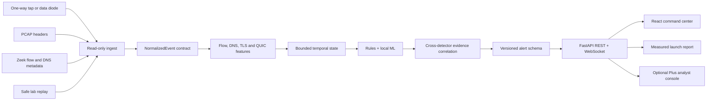

# NetSentinel | SIH 2026 | PS 26145

> **Passive early warning for networks that cannot talk back.**

NetSentinel is a streaming network-threat intelligence platform for
unidirectional monitoring enclaves, data diodes, and passive taps. It observes
flow, DNS, TLS/QUIC, and session metadata; builds bounded temporal context;
and returns explainable alerts with evidence, confidence, provenance, and safe
next steps.

**Team:** Soumdoitya Das and Team NetSentinels
**Problem statement:** AI-Based Detection of Cyber Threats in Unidirectional IP Traffic
**SIH reference:** 26145
**Operating principle:** See everything. Touch nothing. Preserve the evidence.

---

## 1. The problem

Critical-infrastructure operators may mirror traffic into an isolated enclave
through a hardware data diode. The enclave can see traffic but cannot probe a
host, complete a handshake, decrypt a session, or send a blocking command back.

That makes many conventional security workflows incomplete. An endpoint agent
may have process context but no visibility into an isolated link. A signature
sensor may see a packet but not the repeated behavior around it. A dashboard
may show an alert without showing why it should be trusted.

NetSentinel is designed for this exact constraint rather than treating it as a
deployment inconvenience.

## 2. The solution

```text
read-only metadata
    -> normalized events
    -> bounded temporal features
    -> local ML + deterministic rules
    -> cross-detector correlation
    -> versioned evidence alert
    -> live analyst dashboard
```

The system never needs a return path. It does not execute files, download live
malware, decrypt payloads, or block traffic. It produces intelligence for an
authorized SOC to investigate and act on through its existing controls.

## 3. What a judge can prove

Run the exact launch path from the repository root:

```powershell
.\launch_netsentinel_all.bat
```

The terminal will:

1. Score the repository-local CIC-IDS2017 train, validation, and test splits.
2. Replay the safe metadata-only attack-signature bundle through the streaming pipeline.
3. Load the local XGBoost and ONNX model inventory plus deterministic rules.
4. Print the current scorecard from the generated report; no accuracy is hard-coded.
5. Run a strict safety and availability gate before opening the dashboards.

The gate checks the launch report, real-data splits, replay result, backend
health, five ML models, seven rule detectors, read-only flags, and the dashboard
HTTP response. A failed check is visible in the terminal instead of being
hidden behind a green UI.

### Local URLs

| Surface | URL | Purpose |
|---|---|---|
| Existing command center | `http://127.0.0.1:5174` | Live topology, alerts, temporal views, and replay control |
| Existing API | `http://127.0.0.1:8100/docs` | FastAPI contract and health endpoints |
| NetSentinel Plus | `http://127.0.0.1:8200` | Additive investigation console and C2 convergence view |

## 4. Current measured evidence

The launcher writes the authoritative result to
`reports/launch/launch_report.json`. The latest local run reports:

| Evidence | Rows/events | Accuracy | Precision | Recall | F1 | ROC-AUC |
|---|---:|---:|---:|---:|---:|---:|
| CIC-IDS2017 train | 120,000 | 95.42% | 87.63% | 100.00% | 93.41% | 100.00% |
| CIC-IDS2017 validation | 60,000 | 68.55% | 28.52% | 7.44% | 11.80% | 82.35% |
| CIC-IDS2017 test | 60,000 | 84.76% | 71.05% | 57.54% | 63.59% | 90.55% |
| Safe metadata replay | 449 | 61.92% | 100.00% | 58.09% | 73.49% | 79.04% |

The audit also demonstrates `12/12` local model and rule components loaded.
Safe replay p95 latency is measured on every run and shown in the terminal and
report. These are dataset- and scenario-specific measurements, not a universal
malware-detection rate.

## 5. The differentiator: C2 Temporal Convergence

The original system already detects beacon-like behavior. NetSentinel Plus adds
an auditable analyst layer for the harder question: **when does a C2-like case
have enough independent evidence to deserve priority?**

Temporal Evidence Convergence, or TEC, combines:

- cadence and inter-arrival regularity;
- destination concentration and small repeated flows;
- DNS anomaly precursor metadata;
- rare TLS fingerprint metadata when present;
- detector diversity and alert recurrence; and
- explicit provenance and benign alternatives instead of a blacklist-only decision.

```text
triage_score = 100 x (
  0.45 x strongest detector signal +
  0.25 x detector diversity +
  0.15 x recurrence in the bounded window +
  0.15 x independent temporal context
)
```

TEC is deliberately not a new detector-confidence claim. A single high-score
signal remains a single-signal review. The endpoint exposes every factor and
sets `detector_score_unchanged=true`. This gives the analyst a reproducible
convergence explanation without changing the original application decision.

## 6. Threat coverage

| Threat family | Passive evidence | Detection path |
|---|---|---|
| Volumetric DDoS | rate, burst, source entropy, SYN/ACK imbalance | XGBoost plus volumetric rule |
| Botnet C2 beaconing | inter-arrival variation, periodicity, destination concentration | BiLSTM/ONNX plus beacon rule and TEC |
| DGA and DNS tunneling | label length, character entropy, digits, record type, NXDOMAIN context | DGA model plus DNS anomaly rule |
| Encrypted-session malware signals | TLS/QUIC metadata, packet size and timing, fingerprints | encrypted-traffic model; no decryption |
| Reconnaissance and port scanning | host fan-out, port fan-out, sparse scan timing | stateful reconnaissance rule |
| Data exfiltration | outbound/inbound asymmetry, volume and burst context | exfiltration baseline and correlation |
| Legitimate-service abuse | regularity, DNS precursor, asymmetry, known service context | legitimate-service C2 detector |

Coverage is intentionally described as active, partial, or endpoint-only in
`docs/THREAT_COVERAGE_MATRIX.md`. A network-flow system cannot infer process
trees, file semantics, memory behavior, or decrypted content from metadata alone.

## 7. Architecture



### Runtime guarantees

- **Read-only ingest:** no probes, callbacks, inline blocking, or return path.
- **Metadata-only analysis:** TLS/QUIC sessions are not decrypted.
- **Bounded streaming state:** temporal windows and stores are evicted by policy.
- **Evidence-first alerts:** threat class, confidence, detector, features,
  MITRE mapping, timestamp, flow identity, and safety assertions are retained.
- **Fail-visible operation:** missing artifacts, backend health, and dashboard
  availability are printed by `tools/verify_final.py`.
- **Memory-safe audit:** prepared parquet splits are scored in bounded batches;
  the launch audit does not materialize the full dataset matrix at once.

## 8. Three-layer product design

### Layer A: Detection

`netsentinel/` is the local defensive engine. It ingests metadata, extracts
features, updates temporal state, invokes local models and rules, correlates
signals, and publishes alerts.

### Layer B: Evidence and operations

`tools/launch_demo.py` creates the reproducible scorecard. The report separates
fit diagnostics from validation and test evidence. `tools/verify_final.py`
performs the strict pre-judge gate. The existing dashboard remains the primary
operational surface.

### Layer C: Analyst extension

`addons/netsentinel_plus/` is a separate sidecar on port `8200`. It adds TEC,
safe public IOC metadata lookups, bounded provider caching, and optional
redacted analyst briefs. It never changes local detector scores and can be
stopped without stopping the original application.

## 9. Safe demonstration workflow

The repository contains deterministic metadata fixtures for flood,
reconnaissance, beacon-like timing, DNS anomaly, exfiltration, and legitimate
service hard-negative scenarios.

```powershell
python tools\safe_lab\build_attack_test_bundle.py --seed 42
Invoke-RestMethod -Method Post "http://127.0.0.1:8100/api/replay/start?scenario=mixed"
Invoke-RestMethod "http://127.0.0.1:8100/api/forensics/temporal"
Invoke-RestMethod "http://127.0.0.1:8200/api/addon/assessment"
Invoke-RestMethod -Method Post "http://127.0.0.1:8100/api/replay/stop"
```

The fixtures are network signatures, not malware. NetSentinel does not accept
or execute arbitrary malware, exploit files, live C2, or Defender-evasion
content. For authorized real evidence, upload a PCAP or approved Zeek metadata
through the existing API and retain the chain of custody.

## 10. Validation commands

```powershell
# Full judge launch, scorecard, services, and strict gate
.\launch_netsentinel_all.bat

# Manual PowerShell launch with scorecard, all API health checks, and no browser
.\launch_manual.ps1

# Manual launch and open both dashboards
.\launch_manual.ps1 -OpenBrowser

# Strict gate only, with the services already running
python tools\verify_final.py

# Focused sidecar and TEC regression tests
python -m pytest -q tests\test_additive_sidecar.py tests\test_temporal_assessment.py

# Python syntax check
python -m compileall -q addons tools\verify_final.py

# Frontend production build
npm run build --prefix frontend
```

The repository's broader legacy tests include optional PCAP dependencies and
one environment-dependent endpoint smoke test. The focused release gate above
is the reproducible verification path for this additive release.

The manual launcher prints calibration error as an advisory quality metric; it
does not confuse calibration with service health or make it a false failure.

## 11. API surface

| Method | Endpoint | Use |
|---|---|---|
| `GET` | `/api/health` | model, detector, pipeline, and safety status |
| `GET` | `/api/alerts?limit=N` | recent structured alerts |
| `GET` | `/api/forensics/temporal` | bounded temporal telemetry |
| `GET` | `/api/launch/report` | measured launch scorecard |
| `WS` | `/ws` | live alerts and throughput statistics |
| `GET` | `/api/addon/assessment` | C2 Temporal Convergence and provenance |
| `GET` | `/api/addon/lookup` | validated public IOC metadata lookup |
| `GET` | `/api/addon/alert/{id}/brief` | optional redacted analyst brief |

## 12. SIH fit

| SIH evaluation dimension | How NetSentinel answers it |
|---|---|
| Novelty | C2 Temporal Convergence turns repeated, independent metadata into an inspectable review state rather than a one-field guess. |
| Technical complexity | PCAP/Zeek adapters, 78-feature real-data artifact, ONNX wrappers, rules, temporal state, correlation, WebSocket telemetry, and provenance. |
| Feasibility | Runs locally with repository-controlled artifacts; external intelligence is optional, not a runtime dependency. |
| Practicability | Fits a one-way monitoring enclave and hands a scoped case to an existing SOC instead of requiring inline control. |
| Sustainability | Bounded memory, cached optional lookups, explicit data governance, and safe replay make the demo reproducible. |
| Scale and impact | The same contract can consume mirrored flow records from critical infrastructure, finance, telecom, and government networks. |
| UX | A live command center shows evidence, temporal change, model state, confidence, severity, and safe next steps. |
| Future progression | Independent capture-separated datasets, calibration, drift monitoring, asset context, and production identity controls are defined next steps. |

## 13. Repository guide

```text
netsentinel/                         Core passive detection engine
  ingest/                            PCAP, Zeek, and normalized metadata
  forensics/                         Bounded temporal telemetry
  models/                            Trusted XGBoost and ONNX adapters
  detectors/                         Stateful rules and correlation
  pipeline/                          Streaming analysis and alert creation
  api/                               REST and WebSocket routes
frontend/                            Existing React command center
addons/netsentinel_plus/             Additive analyst console
  assessment.py                      C2 Temporal Evidence Convergence
  app.py                              Sidecar API routes
  providers.py                       Optional safe metadata enrichment
  static/index.html                  Live analyst UI
tools/launch_demo.py                 Measured scorecard and safe replay audit
tools/verify_final.py                Strict pre-judge verification gate
data/                                Prepared local datasets and artifacts
reports/launch/                      Current measured launch report
tests/                               Regression and integration tests
docs/                                Architecture, compliance, comparison, and SIH material
```

## 14. Documentation

- [`docs/technical.md`](docs/technical.md) - core architecture and data contracts.
- [`docs/THREAT_COVERAGE_MATRIX.md`](docs/THREAT_COVERAGE_MATRIX.md) - honest coverage boundary.
- [`docs/siH_26145_compliance.md`](docs/siH_26145_compliance.md) - requirement-to-code mapping.
- [`docs/TECHNICAL_DEFENSE_BLUEPRINT.md`](docs/TECHNICAL_DEFENSE_BLUEPRINT.md) - engineering and governance blueprint.
- [`docs/COMPARISON.md`](docs/COMPARISON.md) - capability comparison with endpoint and network tools.
- [`docs/RED_BLUE_TESTING.md`](docs/RED_BLUE_TESTING.md) - safe defensive validation workflow.
- [`docs/PPT.md`](docs/PPT.md) - presentation narrative.
- [`docs/previous-vs-current.md`](docs/previous-vs-current.md) - earlier baseline versus current release.
- [`addons/netsentinel_plus/docs/STARTUP.md`](addons/netsentinel_plus/docs/STARTUP.md) - operator launch runbook.
- [`addons/netsentinel_plus/docs/TECHNICAL.md`](addons/netsentinel_plus/docs/TECHNICAL.md) - sidecar and TEC design.

## 15. Honest boundary

NetSentinel is not an antivirus, sandbox, exploit framework, or endpoint
containment product. A network-flow model cannot promise perfect detection of
every malware family or living-off-the-land action. The correct claim is
stronger and more defensible: NetSentinel adds explainable, temporal,
metadata-only intelligence in a read-only enclave, with measured evidence and
visible limitations.

Never commit provider credentials. Use local environment variables only, rotate
any key exposed outside the machine, and keep sensitive captures out of the
repository. See `SECURITY.md` and `addons/netsentinel_plus/docs/KEY_SETUP.md`.

---

Built for defensive security research and education by Soumdoitya Das and Team
NetSentinels.
