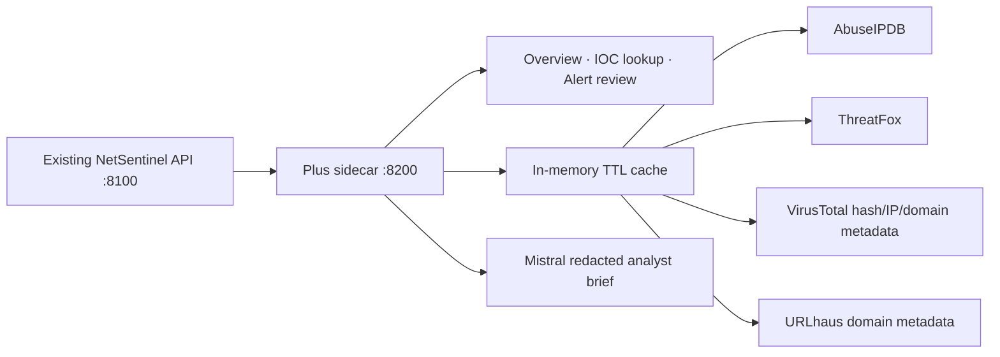

# NetSentinel Plus technical guide

## Purpose

NetSentinel Plus is a sidecar analyst console for the existing NetSentinel
application. It adds context without changing the detector, model artifacts,
alert thresholds, dashboard, or original launch path.

The system is deliberately passive. It handles network metadata and approved
indicator lookups only. It is not an antivirus, malware sandbox, payload
scanner, exploit framework, or traffic-blocking appliance.

## Runtime architecture



The original dashboard remains on `5174`. The original API remains on `8100`.
The sidecar is the only new process and listens on `8200`.

## Data contract

The sidecar accepts exactly three optional indicator types:

| Input | Validation | External use |
|---|---|---|
| Public IP | `ipaddress` validation and `is_global` check | IP reputation |
| Domain | bounded DNS-name format | domain/host reputation |
| SHA-256 | exactly 64 hexadecimal characters | hash metadata only |

Private, loopback, link-local, invalid, and unsupported values are rejected
before a network request. No file bytes, packet payloads, credentials, or
decrypted content enter the sidecar.

## Decision boundary

The local NetSentinel detector remains the authority:

```text
local models + temporal rules + correlation = alert score
optional provider results                    = advisory context
optional Mistral brief                       = human-readable summary
```

External reputation never raises, lowers, or replaces the local confidence.
The UI and endpoint responses state `score_unchanged: true` for this reason.

## C2 Temporal Convergence

The sidecar's original C2 contribution is Temporal Evidence Convergence (TEC).
It ranks a case only when independent metadata supports it: the strongest
existing detector confidence, detector diversity, recurrence in the bounded
window, and temporal signals such as periodicity, port fan-out, burst ratio,
and byte asymmetry. TEC is an analyst-prioritization score, not a replacement
alert confidence and not a claim of malware-detection accuracy.

```text
triage_score = 100 × (
  0.45 × signal_strength +
  0.25 × detector_diversity +
  0.15 × recurrence +
  0.15 × temporal_context
)
```

The endpoint exposes every factor, observed signal, time window, dataset
provenance, and safe next step. A single high-confidence detector cannot
create a high-convergence state by itself. This improves human triage without
rewriting the original detector score or crossing the read-only boundary.

Mistral receives a compact structured record with raw network identities
removed from the prompt. Its output is constrained to assessment, evidence,
and a safe next step. It cannot perform actions in the monitored network.

## Provider behavior

- Credentials are read from environment variables at process startup.
- `.env.local` is ignored by Git and loaded only by the local launcher.
- Responses are reduced to compact fields suitable for analyst review.
- Results are cached for the configured TTL to reduce duplicate lookups.
- A provider outage produces an advisory `unavailable` result.
- Missing credentials produce an explicit offline-safe state.
- The sidecar never downloads samples or follows a malware URL.

## Endpoints

| Method | Path | Result |
|---|---|---|
| `GET` | `/api/addon/health` | sidecar, backend, and provider state |
| `GET` | `/api/addon/status` | non-secret configuration state |
| `GET` | `/api/addon/live` | existing health, alerts, temporal state, and launch report |
| `GET` | `/api/addon/assessment` | TEC analyst prioritization and evidence provenance |
| `GET` | `/api/addon/lookup` | validated IOC metadata enrichment |
| `GET` | `/api/addon/alert/{id}/enrich` | advisory context for an existing alert |
| `GET` | `/api/addon/alert/{id}/brief` | advisory context plus optional Mistral narrative |

## Failure and recovery model

The sidecar is non-critical by design. If it is stopped, the original
NetSentinel detector continues to operate unchanged. If the original backend
is stopped, the sidecar shows the backend as offline and its local IOC lookup
menu remains available when credentials are configured.

There is no automatic retry storm. Requests are bounded by a short timeout,
responses are size-limited, and cached evidence is preferred.

## Operational checks

```powershell
curl.exe http://127.0.0.1:8100/api/health
curl.exe http://127.0.0.1:8200/api/addon/status
curl.exe http://127.0.0.1:8200/api/addon/live
```

Use the original application for replay and network evidence ingestion. Use
Plus for investigation context, not as a replacement for the measured local
classifier.

## Verification evidence

The additive tests cover private-IOC rejection, offline behavior, cache reuse,
score immutability, Mistral prompt redaction, and TEC's empty, single-signal,
and convergent evidence states. Production frontend build validation remains
part of the repository handoff. Benchmark figures
must always be read from the current launch report and must not be copied into
marketing material as universal accuracy claims.
