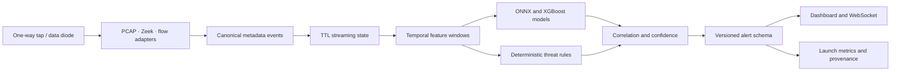

# NetSentinel — SIH 2026 Presentation Blueprint

**Problem Statement:** 26145 — AI-Based Detection of Cyber Threats in
Unidirectional IP Traffic  
**Team:** Soumdoitya Das and Team NetSentinels  
**Format:** 12-minute presentation + 3-minute controlled demonstration

This is a judge-facing writing and visual plan. Replace every bracketed image
slot with a screenshot from the running product or a clean architecture
diagram. Do not use invented benchmark numbers; use the measured values shown
by the launch report.

## Slide 1 — The promise

**Title:** NetSentinel: See Everything. Touch Nothing. Trust the Chain.

**Write:**

Critical infrastructure cannot allow a monitoring system to become a path back
into production. NetSentinel turns one-way traffic metadata into explainable,
time-aware threat intelligence without probes, payload decryption, or inline
blocking.

**Visual:** Full-width dark command-center screenshot with one highlighted
alert and the three words `READ-ONLY · METADATA-ONLY · STREAMING`.

**Speaker line:** “Our product is designed for the environment where the
monitor can observe everything, but is physically unable to talk back.”

## Slide 2 — The operational gap

**Title:** The enclave sees the signal, not the payload

**Write:**

- Data diodes and passive taps protect the production network.
- Conventional controls often assume bidirectional access or decrypted content.
- Analysts still need early warning, evidence, confidence, and bounded latency.

**Visual:** Two-zone diagram: `Production network` → `one-way tap` →
`Monitoring enclave`; draw a strong crossed-out arrow from enclave to
production.

**Speaker line:** “The return path is deliberately absent. That constraint is
our product boundary, not a missing feature.”

## Slide 3 — The solution in one sentence

**Title:** A passive temporal NDR for the unidirectional link

**Write:**

NetSentinel ingests flow records, PCAP-derived metadata, or Zeek JSON; builds
bounded streaming state; combines learned models with deterministic temporal
detectors; and emits a versioned alert with evidence and a smallest-safe review
scope.

**Visual:** Five connected cards: `Ingest` → `Features` → `Models + Rules` →
`Correlation` → `Alert + Dashboard`.

## Slide 4 — What the system detects

**Title:** Six attack families, one evidence contract

**Write:**

| Threat family | Passive signal |
|---|---|
| Volumetric DDoS | packet/byte rate, SYN/ACK behavior, burst ratio |
| Reconnaissance | source fan-out across hosts and ports |
| C2 beaconing | periodic inter-arrival timing and destination concentration |
| DGA / DNS tunnel | entropy, label length, record-type anomalies |
| Encrypted-session risk | TLS/QUIC metadata and traffic-shape features |
| Data exfiltration | asymmetric byte volume and outbound/inbound ratio |

**Visual:** Six-segment threat wheel with a small feature icon per segment.

## Slide 5 — Technical architecture

**Title:** Defense in depth, without a return path

**Write:**

**Visual:** Use the diagram above or export it as a clean SVG. Add a red
`NO RETURN PATH` boundary around the ingest side.

## Slide 6 — The six technical pillars

**Title:** Why this is not a single-model guess

**Write:**

1. **Unidirectional by design:** no source callback, probe, or mitigation path.
2. **Temporal memory:** sliding windows preserve periodicity, bursts, fan-out,
   and byte asymmetry.
3. **Hybrid inference:** learned models handle nonlinear patterns while rules
   preserve transparent safeguards.
4. **Metadata-only encrypted analysis:** TLS/QUIC shape and fingerprints, never
   decrypted payloads.
5. **Evidence-first alerts:** every alert carries identifiers, confidence,
   features, MITRE context, limitations, and review scope.
6. **Operational resilience:** bounded state, offline-safe replay, rate-limited
   optional enrichment, and graceful provider failure.

**Visual:** Six numbered pillars rising behind a single alert card.

## Slide 7 — End-to-end alert

**Title:** From one flow to an explainable investigation

**Write:**

`Observed metadata` → `normalized event` → `temporal state` → `detector
evidence` → `correlated risk` → `alert` → `analyst next step`

Show a sample alert with:

- timestamp and flow identifier;
- threat class, severity, confidence, and detector;
- supporting feature evidence;
- MITRE technique;
- `read_only: true` and `payload_decrypted: false`;
- smallest review boundary, never an automatic block.

**Visual:** Enlarged screenshot of the alert detail view with six callouts.

## Slide 8 — AI and external intelligence boundary

**Title:** AI assists the analyst; it does not invent the verdict

**Write:**

- Local XGBoost, ONNX models, temporal rules, and correlation produce the
  authoritative score.
- Optional AbuseIPDB, ThreatFox, VirusTotal, and URLhaus lookups add advisory
  IOC context.
- Optional Mistral generates a bounded narrative from redacted structured
  evidence.
- External outages, rate limits, or missing keys never change local detection.

**Visual:** Split panel: `Decision plane: local and deterministic` versus
`Context plane: optional and advisory`.

## Slide 9 — Demonstrable product workflow

**Title:** A judge can run the proof in minutes

**Write:**

1. Run the single launcher.
2. Show measured launch audit and model provenance.
3. Start the safe mixed enterprise metadata replay.
4. Watch WebSocket alerts and temporal telemetry move.
5. Open one alert and show evidence, confidence, and response scope.
6. Use the separate Plus console to enrich an authorized public IOC.

**Visual:** Three screenshots: launch terminal, original dashboard, Plus
console. Keep each caption to one sentence.

## Slide 10 — Validation and honesty

**Title:** We show measured performance, not marketing accuracy

**Write:**

The dashboard separates training, validation, held-out test, and safe replay.
The launch report records data provenance, rows, thresholds, latency, and
limitations. Current benchmark results are shown exactly as measured; they are
not presented as universal real-world malware accuracy.

**Visual:** Screenshot of the scorecard and a confusion-matrix/per-threat
metrics panel. Highlight `held-out test` rather than training accuracy.

**Speaker line:** “Trust is a feature. A judge should be able to see where the
system is strong and where additional data is required.”

## Slide 11 — Innovation and defensibility

**Title:** The moat is the operating constraint

**Write:**

- Designed for one-way monitoring rather than retrofitting an active SOC tool.
- Correlates time, topology, protocol behavior, and model evidence in one
  investigation record.
- Makes legitimate cloud-service traffic a hard-negative case instead of
  blindly blocking popular services.
- Preserves chain of custody through bounded metadata, provenance, and safe
  replay artifacts.

**Visual:** Comparison matrix: `Active assumption`, `payload dependence`,
`single-flow alert`, `opaque response` versus NetSentinel’s passive alternatives.

## Slide 12 — Use cases and business value

**Title:** Built for the networks that cannot afford a return path

**Write:**

- Critical infrastructure and OT monitoring enclaves.
- Telecom peering and backbone observation points.
- Banking, payments, and regulated data-center links.
- Government and defense networks using data diodes.
- Managed security teams needing explainable, low-touch triage.

**Business value:** earlier detection, lower analyst search time, safer
segmentation, auditable evidence, and deployment without changing production
traffic.

**Visual:** Five vertical use-case cards with one measurable operational benefit
per card.

## Slide 13 — Feasibility and roadmap

**Title:** A credible path from prototype to deployment

**Write:**

**Now:** local replay, PCAP/Zeek adapters, bounded streaming state, hybrid
detectors, dashboard, audit report.  
**Next:** independent temporal holdouts, calibration, per-site baselines,
signed model registry, role-based access, and production observability.  
**Never:** inline blocking, active probing, payload decryption, or malware
execution in the monitoring enclave.

**Visual:** Three-stage roadmap: `SIH prototype` → `pilot enclave` →
`regulated deployment`.

## Slide 14 — Close and ask

**Title:** Intelligence without a return path

**Write:**

NetSentinel gives a protected monitoring enclave a practical answer to a hard
question: how do we detect evolving threats when we can observe traffic but
cannot touch the network? We provide bounded, explainable, measurable evidence
that helps defenders act safely.

**Final ask:** Evaluate the system on the quality of its evidence, its safety
boundary, and its reproducible demonstration—not on an unsupported claim of
perfect detection.

**Visual:** Product logo/tagline, SIH problem statement number, team name, and
one QR code to the repository or local demo instructions.

## Judge-facing scorecard

Use this as the final slide appendix or speaker preparation. It is a project
readiness frame, not an official SIH scoring formula.

| Dimension | Proof to show |
|---|---|
| Problem fit | One-way architecture and PS-26145 mapping |
| Technical depth | six threat families, temporal state, hybrid inference |
| Innovation | passive-by-design correlation and smallest-safe review scope |
| Usability | single launch, readable dashboard, analyst workflow |
| Reliability | held-out metrics, latency, provenance, limitations |
| Feasibility | safe replay, PCAP/Zeek adapters, offline operation |
| Business value | regulated, OT, telecom, banking, and government use cases |

## Presenter checklist

- Do not claim 100% accuracy, universal malware detection, or superiority over
  commercial antivirus.
- Do not demonstrate live malware, C2, exploit delivery, or Defender evasion.
- Use the local safe metadata fixture for the demo.
- Keep the original dashboard and the additive console visibly separate.
- Show one alert from evidence to action scope in under 45 seconds.
- End with the read-only guarantee and the next validation milestone.

