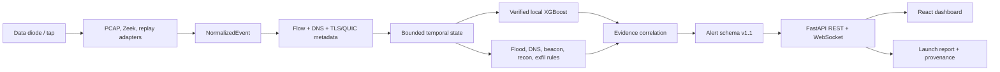

# NetSentinel Technical Guide

**Smart India Hackathon 2026 | Problem Statement 26145**<br>
**Prepared by Soumdoitya Das and Team NetSentinels**

## 1. What the system does

NetSentinel is a passive network early-warning system for an observation
enclave behind a tap or data diode. It consumes one-way flow metadata, DNS
metadata, TLS/QUIC session metadata, PCAP headers, Zeek records, or an offline
safe replay. It produces structured alerts with confidence, evidence, timing,
MITRE technique references, benign alternatives, and a narrow recommended next
check.

It is not an endpoint antivirus. It does not execute files, inspect process
memory, decrypt payloads, send probes, block traffic, or call back to a source.

## 2. Architecture



### Runtime responsibilities

| Layer | Responsibility | Main location |
|---|---|---|
| Ingest | Read-only PCAP, Zeek, and replay input | `netsentinel/ingest/` |
| Extraction | Convert packets and records into flow metadata | `netsentinel/extractor/` |
| State | Keep bounded host and temporal windows | `netsentinel/features/`, `netsentinel/forensics/` |
| Detection | Rules plus the local real-data XGBoost artifact | `netsentinel/detectors/`, `netsentinel/models/` |
| Correlation | Combine independent signals and alternatives | `netsentinel/detectors/correlation.py` |
| Delivery | REST endpoints, WebSocket events, dashboard | `netsentinel/api/`, `frontend/src/` |
| Evidence | Reproducible scores and fixture manifests | `tools/launch_demo.py`, `reports/launch/` |

## 3. Detection path

1. An adapter reads a record without retaining payload content.
2. The record is normalized into the shared flow/event contract.
3. Rolling state calculates rates, inter-arrival variation, entropy, fan-out,
   protocol mix, SYN/ACK balance, and outbound/inbound asymmetry.
4. Rules and the trusted CIC-IDS2017 XGBoost model score the event.
5. Correlation links compatible evidence over a bounded window.
6. The alert manager publishes one versioned record to REST and WebSocket.
7. The dashboard presents the alert, evidence, temporal context, confidence,
   and the recommended analyst check.

## 4. Threat coverage

The current coverage contract maps 21 major behavior families:

- **Active:** direct flood behavior, horizontal/vertical scanning, periodic
  beaconing, DNS anomaly/DGA patterns, legitimate-service behavior, and large
  asymmetric transfers.
- **Partial:** reflection, slow/distributed reconnaissance, fast flux, TLS or
  QUIC metadata, proxies, cloud exfiltration, brute-force shape, lateral
  movement shape, and malformed protocol indicators.
- **Endpoint-only:** file malware identification, process injection,
  persistence, exploit payloads, ransomware, and local evasion.

The endpoint-only boundary is deliberate. A network-flow observation cannot
prove which file or process caused a connection.

## 5. Data and model evidence

The repository contains a prepared, capture-grouped CIC-IDS2017 evaluation
slice and its verified binary XGBoost artifact:

- 240,000 prepared rows with 78 engineered features.
- Train: 120,000 rows; validation: 60,000; test: 60,000.
- Test accuracy: 0.8476; precision: 0.7105; recall: 0.5754; F1: 0.6359;
  ROC-AUC: 0.9055.
- The validation operating point is retained. The score is not presented as a
  universal malware-detection rate.

The safe lab bundle contains 449 labelled metadata events in JSONL, CSV, and
Parquet. It covers flood-like rates, reconnaissance fan-out, periodic timing,
DNS entropy, DNS-tunnel-like labels, asymmetric transfer, legitimate-service
hard negatives, and benign activity.

## 6. Alert contract

Each alert includes, where available:

```json
{
  "timestamp": "2026-08-30T00:00:00Z",
  "flow_id": "flow-123",
  "threat_class": "C2 Beacon",
  "confidence": 0.90,
  "supporting_evidence": ["Inter-arrival CV 0.027", "mean 32.9s"],
  "mitre": {"technique": "T1071"},
  "read_only": true,
  "payload_decrypted": false,
  "containment_scope": {"automatic_enforcement": false}
}
```

Confidence is an investigation priority signal, not proof of intent. The
dashboard always keeps the observed evidence and limitations beside it.

## 7. Launch and operations

Run from the repository root:

```powershell
cd "D:\PORT SCANNING CYS IP FLOW\testing-main"
.\launch_netsentinel.bat
```

The launcher scores the real prepared splits and the safe replay first, writes
`reports/launch/launch_report.json`, then starts:

- API: `http://localhost:8100`
- Dashboard: `http://localhost:5174`
- API documentation: `http://localhost:8100/docs`

To stop both local processes:

```powershell
Get-NetTCPConnection -LocalPort 8100,5174 -State Listen -ErrorAction SilentlyContinue |
  ForEach-Object { Stop-Process -Id $_.OwningProcess -Force }
```

Useful API checks:

```powershell
curl.exe http://localhost:8100/api/health
curl.exe http://localhost:8100/api/coverage
curl.exe http://localhost:8100/api/launch/report
curl.exe -X POST "http://localhost:8100/api/replay/start?scenario=mixed_enterprise"
```

## 8. Verification

```powershell
python tools\launch_demo.py
python -m pytest -ra -q tests\test_coverage_matrix.py tests\test_launch_audit.py tests\test_alert_scope.py tests\test_detectors.py tests\test_gating_integration.py tests\test_live_detection_baselines.py tests\test_temporal_forensics.py tests\test_artifact_security.py tests\test_dataset_factory.py tests\test_safe_attack_bundle.py
cd frontend
npm run build
```

The current environment loads all four ONNX wrappers plus the trusted local
XGBoost artifact and rule detectors (`12/12` registry components). The
ONNX-specific verification command is documented in
`addons/netsentinel_plus/docs/ONNX_ENABLEMENT.md`. PCAP-specific tests also
require Scapy and an authorized capture fixture.

## 9. Security boundary

Do not upload executables, malware samples, credentials, payload-bearing
captures, or live C2 material. For authorized network testing, use a sanitized
PCAP, Zeek metadata, or the repository safe lab bundle. NetSentinel is a
defensive observation layer and does not replace endpoint security controls.
